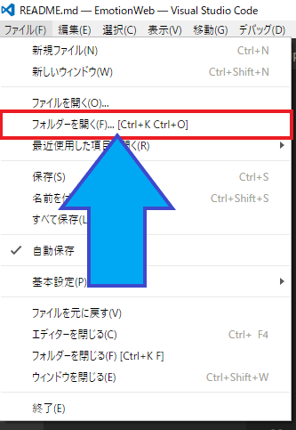
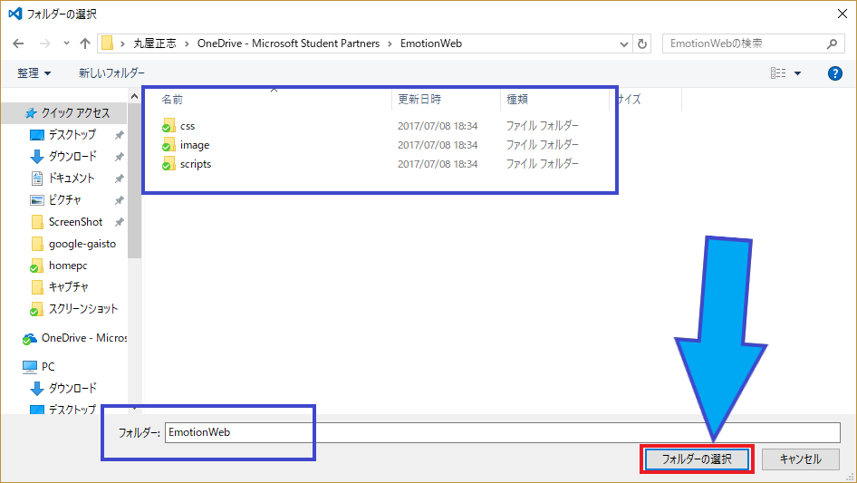
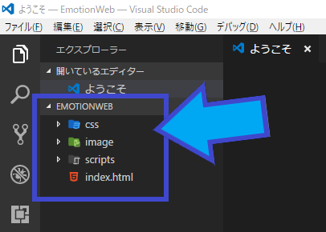
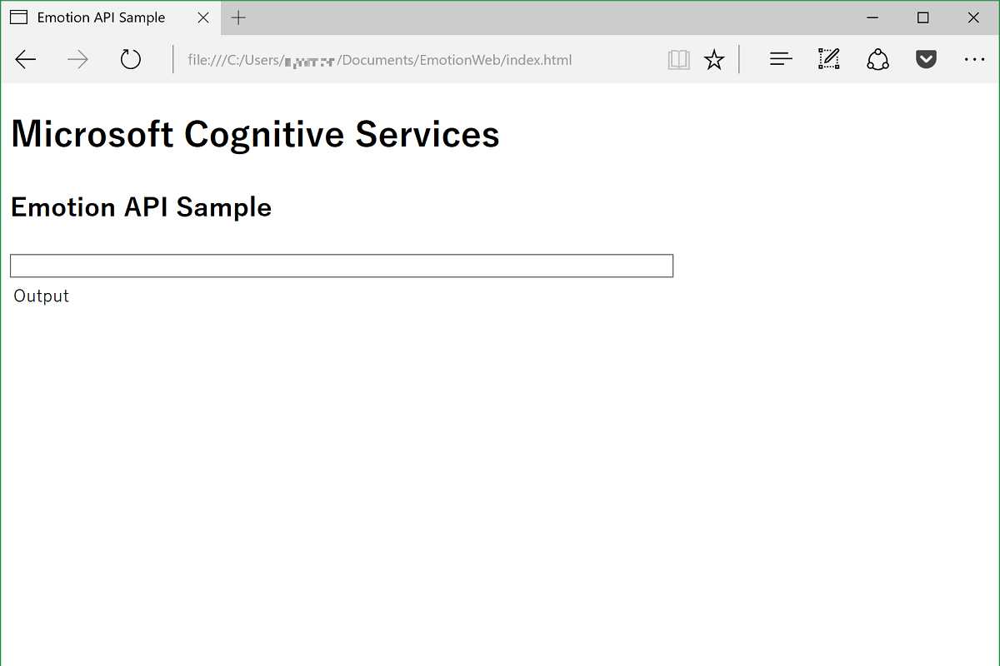
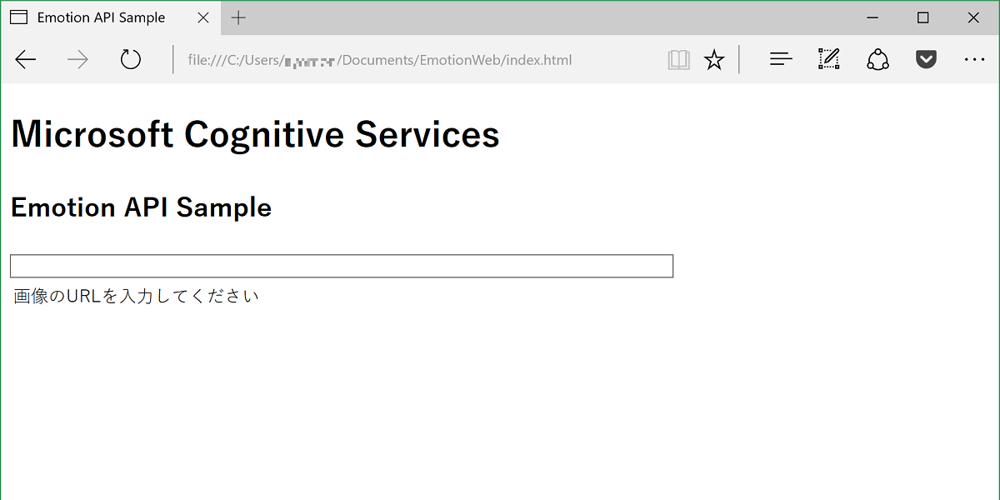

# 【NKC生限定】名古屋で始めるAI を使いこなせ！ Cognitive Services 勉強会！

---

# Microsoft Cognitive Services を使った表情分析 Web アプリ
Microsoft Cognitive Services は 画像、文章、言語、情報を処理する機能を API 経由で利用できるサービスです。
Cognitive Services の一つである Emotion API では、画像を分析して人間の顔やその表情を数値化し、結果を JSON 形式で取得することができます。

今回は オンライン画像 (URL) を入力すると、顔の表示位置と表情分析スコアを表示する Web アプリを作成します。JavaScript (jQuery 使用) で記述しており、Web サーバーがなくてもローカルでも実行＆動作確認ができます。

# 手順
- Cognitive Services 利用に必要な環境、APIキー確認の準備
    - 開発環境
    - ハンズオンファイル一式
- Web アプリの実装
    - ハンズオンファイルの確認
    - 表示ページの作成
    - Emotion API を呼び出すロジックの作成

# 開発環境
今回は Visual Studio Code を使用します。もちろんご自分の コーディングツールや Web 開発環境でも大丈夫です。

- インストール方法は [Visual Studio Code のインストール方法](http://qiita.com/annie/items/cd24a22eae7f07536dd1) をご覧ください。

# ハンズオンファイル一式
- index.html
- css
    - site.css
- scripts
    - script.js
    - jquery-3.1.0.min.js
- image
    - Rectangle.png //認識された顔の位置を表示するための正方形(透過png)

 [こちら](https://emotionwebsto.blob.core.windows.net/handson/EmotionWeb.zip)から一式をダウンロードして、ZIPを展開してデスクトップに配置します．

## Web アプリの実装 **ハンズオンファイル** の確認
Visual Studio Code を起動し、上部ツールバーの[ファイル]→[フォルダを開く]をクリックします．

デスクトップに配置した EmotionWeb フォルダーまで移動して選択し、[フォルダの選択]をクリックして確定します．

*EmotionWeb* フォルダの内容が表示されるのを確認してください．

これらのファイルをベースにコードを記述していきます．

## 表示ページの作成(index.html, site.css)

### index.html の編集

*index.html* をクリックしてエディター画面に表示します。
head 部分には CSS および JavaScript ファイルが挿入されています。

index.html
~~~html
<head>
    <meta http-equiv="Content-Type" content="text/html; charset=utf-8"/>
    <title>Emotion API Sample</title>
    <link rel="stylesheet" href="css/site.css">
    
    
</head>
~~~

body 本体に画像URLを入力する TextBox と、画像および分析結果を表示する部分を、以下の通り記述します．

index.html
~~~html
<body>
    

        <h1>Microsoft Cognitive Services</h1>
        <h2>Emotion API Sample</h2>
        <!--画像のURLを入力-->
        <input type="url" id="imageUrlTextbox" class="urlinput">
    

    <table>
        <tr>
            <td class="OutputTh">
                <!--出力結果-->
                
Output

            </td>
            <td>
                <!--出力画像-->
                

                
                
                

            </td>
        </tr>
    </table>
</body>
~~~

上部ツールバーの[ファイル]→[保存]をクリックして (または *Ctrl+S*)  index.html を保存します．

### site.css の編集

サイドバーに表示されている site.css クリックしてエディター画面に表示します． 
body 部分にfont-family が指定されています．

site.css
~~~css
body
{
    font-family: "Yu Gothic"; /* 環境に合わせてお好みのフォントを使用してください */
}
~~~

画面表示に必要なサイズ、フォーマットを以下のように記述します。

site.css
~~~css
/* URL TextBox のサイズ指定 */
.urlinput
{
    width: 600px;
}

/* 分析結果の表示テーブルのフォーマット指定 */
td.OutputTh
{
    text-align: left;
    vertical-align: top;
    width: 300px;
}

/* 画像の表示フォーマット指定 */
#PhotoDiv{
  position: relative;
}

/* 顔認識 (正方形) のフォーマット指定 */
#Rectangle
{
    opacity: 0.5;
    z-index: 10;
    position: absolute;
    display: none;
}
~~~

*site.css* を保存します．

### 画面の確認
ここで index.html をブラウザーで開きます．
タイトルやURL入力部分などが表示されるのを確認してください．

## Emotion API を呼び出すロジックの作成(script.js)
script.js をクリックしてエディター画面に表示します。 
function() の中に画像を表示する showImage() と 画像を分析する getFaceInfo() が記述されています。ここからそれらのロジックを記述していきます。

script.js
~~~js
$(function () {

    showImage();    // 画像を画面に表示
    getFaceInfo();  // 画像を分析

});
~~~

### 画像を画面に表示する (showImage)

textBox に入力された文字列を imageUrl で取得して画面に表示するロジックを、function() 内部に以下のように記述します。

script.js
~~~js
$(function () {

    // 画像を画面に表示
    var showImage = function () {
        var imageUrl = $("#imageUrlTextbox").val();
        if (imageUrl) {
            $("#ImageToAnalyze").attr("src", imageUrl);
        }
    };

    showImage();    // 画像を画面に表示
    getFaceInfo();  // 画像を分析

});
~~~

### 画像を分析する (getFaceInfo)

**EmotionAPI の呼び出しに必要なパラメーターの取得、初期メッセージのセット**

showImage の下に、getFaceInfo を追加します。 
Emotion API の サブスクリプションキー、画像URL、Emotion API の呼び出し URL を以下のように記述します。合わせて画面に表示する初期メッセージも記述しています。

script.js
~~~js
$(function () {

    // 画像を画面に表示
    var showImage = function () {

    :
    省略
    :

    };

    //画像の分析
    var getFaceInfo = function () {

        // Emotion API の Subscription Key をセット
        // お持ちの Subscription Key をコピーしてください
        var subscriptionKey = "YOUR_SUBSCRIPTION_KEY";

        // 画像 URL をセット
        var imageUrl = $("#imageUrlTextbox").val();

        // Emotion API 呼び出し URL をセット
        var webSvcUrl = "https://api.projectoxford.ai/emotion/v1.0/recognize";

        // 画面に表示するメッセージをセット
        var outputDiv = $("#OutputDiv");

        if(document.getElementById('imageUrlTextbox').value=="")
        {
            // 初期設定
            outputDiv.text("画像のURLを入力してください");
        }
        else{
            // 画像分析中
            outputDiv.text("分析中...");
        }

        // Emotion API を呼び出すためのパラメーターをセットして呼び出し
        // **次の項目で作成します**

    };

    showImage();    // 画像を画面に表示
    getFaceInfo();  // 画像を分析

});
~~~

**Emotion APIを呼び出して画像分析結果を取得**

Emotion API を呼び出すパラメーターをセットして呼び出すロジックを下記のように記述します。

>分析結果を取得できたかどうかは data.length を調べて判定します。

script.js
~~~js
$(function () {

    :
    省略
    :

    var getFaceInfo = function () {

    :
    省略
    :

        // Emotion API を呼び出すためのパラメーターをセットして呼び出し
        $.ajax({
            type: "POST",
            url: webSvcUrl,
            headers: { "Ocp-Apim-Subscription-Key": subscriptionKey },
            contentType: "application/json",
            data: '{ "Url": "' + imageUrl + '" }'
        }).done(function (data) {

            // データが取得出来た場合
            if (data.length > 0) {
                // 検出された顔の表示位置を取得
                // 画面に描画
                // 検出された表情スコアを取得
                // 表情スコアを表示
                // **次の項目で作成します**
            }
            // データが取得できなかった場合
            else {
                outputDiv.text("検出できませんでした");
            }

        // エラー処理
        }).fail(function (err) {
            if(document.getElementById('imageUrlTextbox').value!="")
            {
                $("#OutputDiv").text("ERROR!" + err.responseText);
            }
        });

    };

    showImage();
    getFaceInfo();

});
~~~

**画像分析結果を加工して表示**

取得した画像分析データ (顔の表示位置、表情スコア) を加工して表示するロジックを下記のように記述します。
> 画像に 正方形の画像 (image/Rectangle.png) を #Rectangle で重ね合わせて表示し、顔の表示位置を表します。表情スコアは小数点6位までを残して OutputText にセットし、outputDiv で表記します。

script.js
~~~js
$(function () {

    :
    省略
    :

    var getFaceInfo = function () {

    :
    省略
    :

        // Emotion API を呼び出すためのパラメーターをセットして呼び出し

    :
    省略
    :

            // データが取得出来た場合
            if (data.length > 0) {
                // 検出された顔の表示位置を取得
                var faceRectange = data[0].faceRectangle;
                var faceWidth = faceRectange.width;
                var faceHeight = faceRectange.height;
                var faceLeft = faceRectange.left;
                var faceTop = faceRectange.top;

                // 画面に描画
                $("#Rectangle").css("top", faceTop);
                $("#Rectangle").css("left", faceLeft);
                $("#Rectangle").css("height", faceHeight);
                $("#Rectangle").css("width", faceHeight);
                $("#Rectangle").css("display", "block");

                //小数点6位までを残す関数 (表情スコアの丸めに利用)
                function floatFormat( number ) {
                    return Math.round( number * Math.pow( 10 , 6 ) ) / Math.pow( 10 , 6 ) ;
                }

                // 検出された表情スコアを取得
                var faceScore = data[0].scores;
                var faceAnger = floatFormat(faceScore.anger);
                var faceContempt =  floatFormat(faceScore.contempt);
                var faceDisgust = floatFormat(faceScore.disgust);
                var faceFear = floatFormat(faceScore.fear);
                var faceHappiness = floatFormat(faceScore.happiness);
                var faceNeutral = floatFormat(faceScore.neutral);
                var faceSadness = floatFormat(faceScore.sadness);
                var faceSurprise = floatFormat(faceScore.surprise);

                // 表情スコアを表示
                var outputText = "";
                outputText += "<h3>" + "結果:" + "</h3>";
                outputText += "怒り　　: " + faceAnger + " ";
                outputText += "軽蔑　　: " + faceContempt + " ";
                outputText += "ムカつき: " + faceDisgust + " ";
                outputText += "恐れ　　: " + faceFear + " ";
                outputText += "喜び　　: " + faceHappiness + " ";
                outputText += "無表情　: " + faceNeutral + " ";
                outputText += "悲しみ　: " + faceSadness + " ";
                outputText += "驚き　　: " + faceSurprise + " ";

                outputDiv.html(outputText);

            }
            // データが取得できなかった場合

    :
    省略
    :

    };

    showImage();
    getFaceInfo();

});
~~~

**URL変更時の動作 (再度分析＆表示)**
textBox が変更されたときに再度分析&表示するロジックを下記のように記述します。

>顔の位置を示す正方形 (#Rectangle) を一旦消去します。(hideMakers)

script.js
~~~js
$(function () {

    // 画像を画面に表示
    var showImage = function () {

    :
    省略
    :

    };
    // 画像の分析
    var getFaceInfo = function () {

    :
    省略
    :

    };

    // 表示するものがない場合
    var hideMarkers = function () {
        $("#Rectangle").css("display", "none");
    };

    // URL が変更された場合（再度分析＆表示)
    $("#imageUrlTextbox").change(function () {
        hideMarkers();
        showImage();
        getFaceInfo();
    });

    showImage();
    getFaceInfo();

});
~~~

script.js を忘れずに保存します。

完成形は[こちら](./doc/sample_script_js.md)をご参考

# アプリケーションの動作確認
index.html をブラウザーで開きます。

オンライン画像の URL (例えばこちら↓) をコピーして、テキストボックスにペーストします。
[https://emotionwebsto.blob.core.windows.net/handson/emotionweb_happiness.jpg](https://emotionwebsto.blob.core.windows.net/handson/emotionweb_happiness.jpg)

画像と分析結果が表示されれば、アプリケーションは完成です。

# Appendix
参考サイト
- [人工知能パーツ Microsoft Cognitive Services を使った表情分析アプリを作ろう！ (Emotion API × JavaScript 編)](http://qiita.com/annie/items/96b37ef94885510c1b6b)
- [annie](http://qiita.com/annie)
